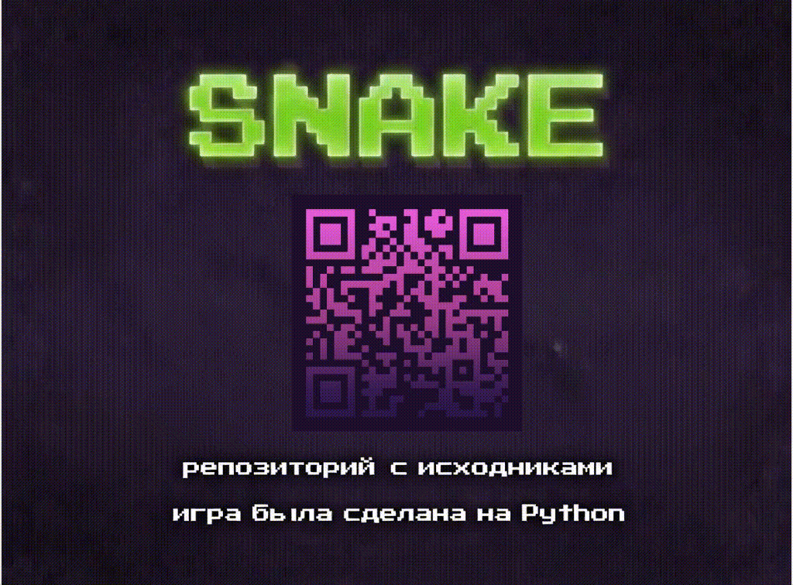
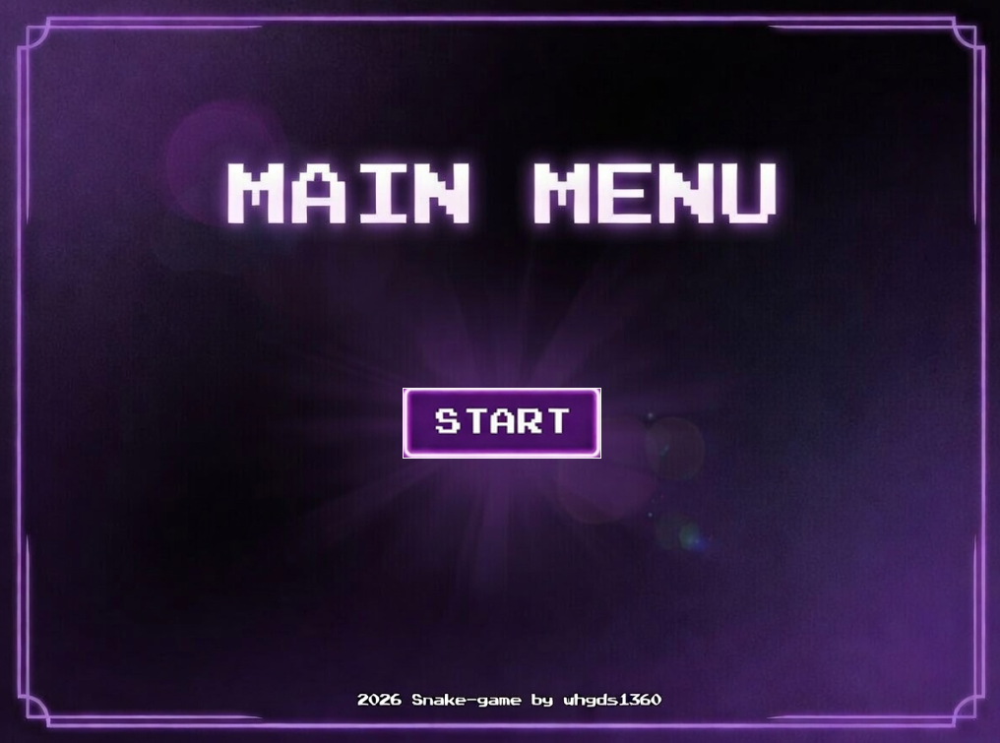
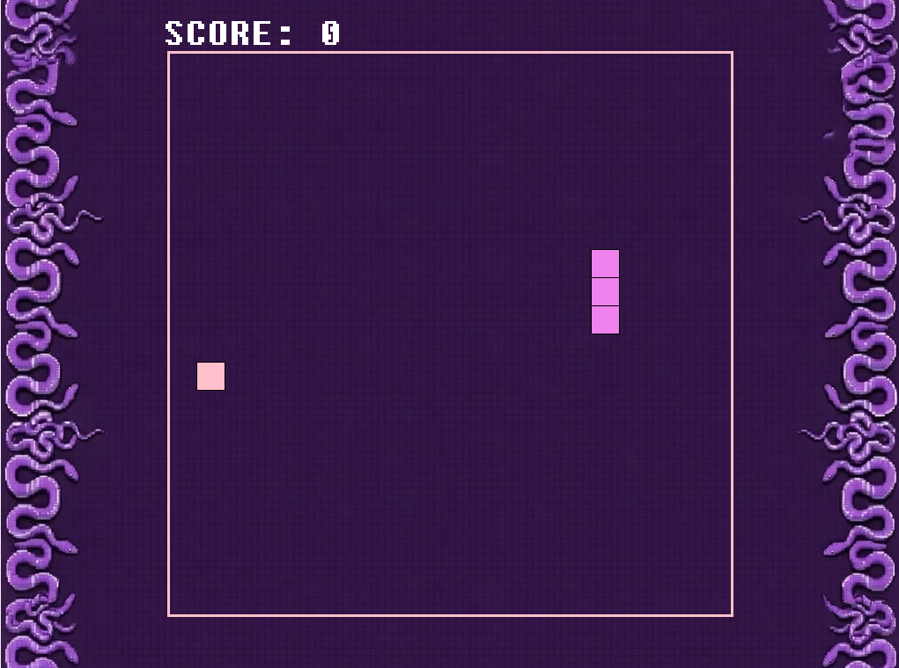
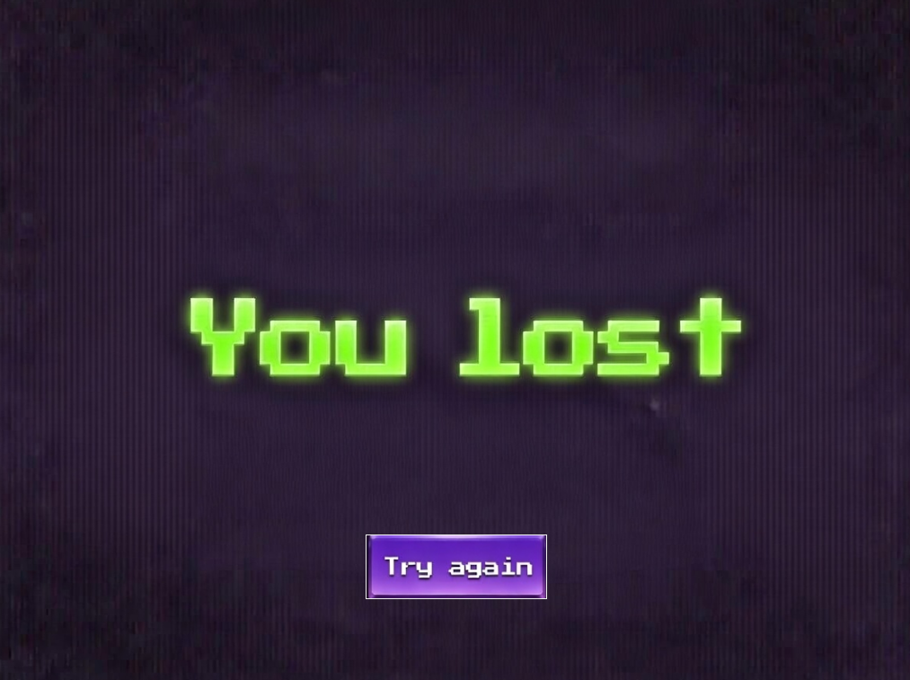

# 🐍 Snake Game (Змейка)
## Реализация классической игры "Змейка" с современным интерфейсом на Python.
[](https://python.org)
[](https://docs.python.org/3/library/tkinter.html)
[](https://docs.python.org/3/library/pathlib.html)
[](https://pillow.readthedocs.io/)
[](https://docs.python.org/3/library/configparser.html)
[](https://docs.python.org/3/library/abc.html)
[](https://docs.python.org/3/library/typing.html)
[](https://docs.python.org/3/library/__future__.html)
[](https://docs.python.org/3/library/random.html)
[](https://docs.pydantic.dev/)
[](https://loguru.readthedocs.io/)
[](https://opensource.org/licenses/MIT/)

## 📸 Скриншоты

### Игровой процесс


### Экран меню


### Игровой процесс


### Экран поражения


## 📁 Структура проекта
<pre>
snake-game/
├── 📁 game/
│   ├── 📁 entities/
│   │   ├── 📄 Food.py        # Еда (генерация, отрисовка)
│   │   └── 📄 Snake.py       # Змейка (отрисовка начальной змеи, коллизии)
│   │
│   ├── 📁 scenes/
│   │   ├── 📄 LoadScreen.py  # Загрузочный экран (при запуске игры)
│   │   ├── 📄 Menu.py        # Экран меню
│   │   ├── 📄 LoseScreen.py  # Экран поражения
│   │   ├── 📄 WinScreen.py   # Экран победы
│   │   └── 📄 Game.py        # Основная игровая сцена
│   │
│   ├── 📁 utils/
│   │   ├── 📄 ResourceManager.py   # Управление ресурсами
│   │   └── 📄 Move.py              # Управление движением змейки (Направление, отрисовка сегментов)
│   │
│   ├── 📁 assets/
│   │   │ └── 📁 icon/
│   │   │      └── 🖼️ app_icon.ico # иконка приложения
│   │   └── 📁 scenes/
│   │        ├── ️️🖼️ BackGroundMenu.jpg  # Задний фон меню
│   │        ├── ️️🖼️ BackGroundGame.jpg  # Задний фон экрана игры
│   │        ├── ️️🖼️ LoadScreen.png      # Задний фон экрана загрузки
│   │        ├── ️️🖼️ LoseScreen.jpg      # Задний фон экрана поражения
│   │        ├── ️️🖼️ WinScreen.jpg       # Задний фон экрана победы
│   │        ├── ️️🖼️ Start.png           # Кнопка "Start"
│   │        └── 🖼️ TryAgain.png        # Кнопка "Try again"
│   │
│   ├── 📄 config.ini   # Настройки игры  
│   └── 📄 main.py      # Точка входа
│ 
├── 📄 requirements.txt # Файл зависимостей
├── 📄 .gitignore  # Исключения для Git
└── 📄 README.md   # Документация
</pre>
## 🎮 Геймплей

- **Управление**: стрелки клавиатуры (← ↑ → ↓)
- **Цель**: набрать максимальное количество очков, поедая еду
- **Победа**: заполнить всё игровое поле змеей
- **Поражение**: столкновение со стеной или собственным хвостом
- **Счет**: отображается в верхней части экрана

## 🚀 Быстрый старт

### Предварительные требования
- Python 3.12
  - При версии ниже заявленной игра может работать некорректно (могут возникать проблемы с импортами)
  - При версии выше заявленной выявлена проблемы с компиляцией (возникает от версии интерпретатора 3.13 и выше)
- Tkinter - интерфейс
- Pydantic - современные дата-классы с автоматической валидацией
- Pillow - работа с изображениями
- Pathlib - работа с путями файлов
- Configparser - работа с конфигурационными файлами
- ABC - абстрактные методы
- Typing - аннотации типов
- Future - аннотации в коде для совместимости с python < 3.10
- Random - генерация псевдослучайных чисел
- Loguru - логирование и отладка

### Установка и запуск

1. **Клонируйте репозиторий:**
```bash
git clone https://github.com/whgds1360/snake-game.git
```
2. **Установите необходимые зависимости:**
```bash
#Переход к директории игры
cd snake-game

#Установка зависимостей
pip install -r requirements.txt
```

3. **Запустите игру:**
```bash
#Переход в основную папку с игрой
cd game

#Запуск python скрипта
python main.py
```

### Компиляция кода
#### Дополнительные требования
- nuitka - это оптимизирующий компилятор для языка Python, который преобразует ваш Python-код в исполняемые файлы или в исходный код на C/C++. 
  - Проверял именно его и с ним всё работает корректно, также рекомендую его потому, что при завершении компиляции на другом устройстве вам не потребуется установленный интерпретатор python.
1. **Установка пакета nuitka:**
```bash
pip install nuitka
```
2. **Для компиляции введите следующую команду в терминал:**
```bash
#Обратите внимание, что вы находитесь в директории игры в основной папке game!
nuitka --standalone --onefile --enable-plugin=tk-inter --include-data-dir=utils=utils --include-data-dir=entities=entities --include-data-dir=scenes=scenes --include-data-dir=assets=assets --include-data-file=config.ini=config.ini main.py
```
